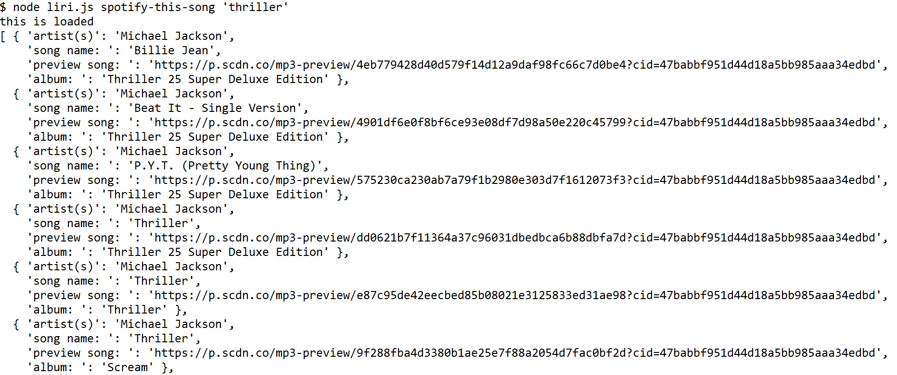

# LIRI Bot

### LIRI Bot Functionality

LIRI is like iPhone's SIRI. However, while SIRI is a Speech Interpretation and Recognition Interface, LIRI is a Language Interpretation and Recognition Interface. LIRI will be a command line node app that takes in parameters and gives you back data.

***

This command will show my last 20 tweets and when they were created at in my terminal/bash window.

***

This command will use node-spotify-api package to search and show 'artist, song's name, preview link of the song, the album name'.

***

This command will use the request package and an API key to retrieve data from the OMDB API. 

***

Using the fs Node package, LIRI will take the text inside of random.txt and then use it to call one of LIRI's commands.